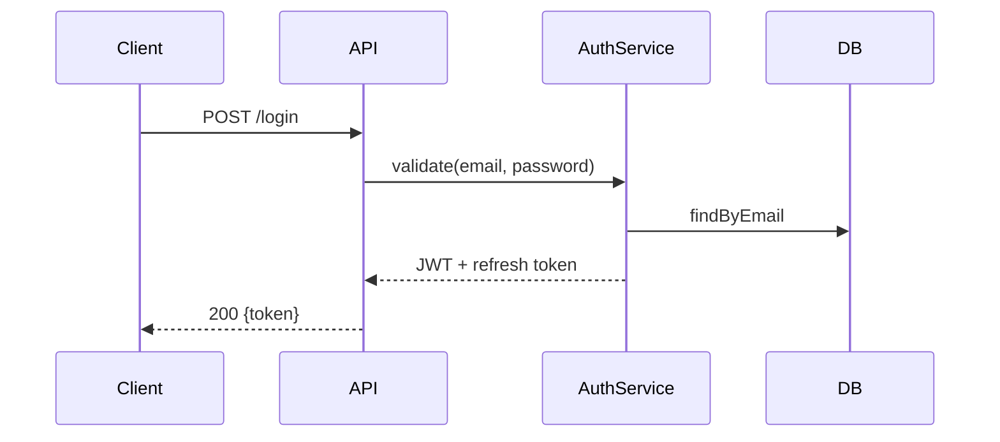

<!--
  TÜRKÇE AÇIKLAMA
  ───────────────
  Bu skill, kod tabanını analiz edip "bu proje nasıl çalışır" haritası çıkarır.
  Projeye katılan yeni kişi (veya 6 ay sonra sen) için mimari rehber, kurulum
  adımları ve "nereye ne eklenir" bölümü üretir. Kurulum adımlarını gerçekten
  test eder — çalışmayan onboarding dokümanı, olmayandan kötüdür.

  NE ZAMAN: Yeni ekip üyesi gelmeden önce, proje devri, açık kaynak yayını öncesi.
  ÇIKTI:    ARCHITECTURE.md + doğrulanmış kurulum rehberi.
-->

# Onboarding Doc Generator Skill

## When to Trigger

- Before a new team member joins
- When handing the project to another team
- Before open-sourcing
- When you realize "only X knows how this works"

## Step-by-Step Process

### 1. Projeyi Keşfet

- Klasör yapısı (2 seviye), giriş noktaları (main, index, app)
- Framework, veritabanı, harici servisler, kuyruk/cache
- Build ve test komutları (package.json scripts, Makefile)
- `.agent/knowledge/` varsa oradaki kararları rehbere işle

### 2. Kritik Akışları Çıkar

En önemli 3-5 iş akışını uçtan uca izle (ör. auth, ödeme, ana CRUD):



### 3. ARCHITECTURE.md Yaz

```markdown
# Architecture

## Ne Yapar (1 cümle)
## Stack
## Klasör Haritası — her klasörün tek cümlelik görevi
## Kritik Akışlar — mermaid diyagramlarıyla
## Veri Modeli — ana tablolar/ilişkiler
## Harici Bağımlılıklar — servis, ne için, nerede konfigüre
## Nereye Ne Eklenir
- Yeni endpoint → src/api/routes/ + service + test
- Yeni sayfa → src/pages/ + route kaydı
- Yeni migration → npm run migration:create
## Bilinen Tuzaklar — .agent/knowledge gotcha'larından
```

### 4. Kurulum Rehberini DOĞRULA

Adımları temiz ortamda (yeni klasör/container) sırayla çalıştır:

```bash
git clone ... && cd ...
cp .env.example .env    # hangi değerler zorunlu?
npm install
npm run db:migrate
npm run dev             # gerçekten açılıyor mu?
npm test                # gerçekten geçiyor mu?
```

**Çalışmayan adımı düzelt veya eksik ön koşulu belgele.** Denenmemiş adım rehbere giremez.

### 5. Rapor

```markdown
## Onboarding Doc Hazır
- ARCHITECTURE.md: 5 akış diyagramı, klasör haritası, tuzak listesi
- Kurulum: 7 adım, temiz ortamda doğrulandı ✅
- Doğrulanamayan: production deploy adımı (erişim yok) — işaretlendi
```

## Rules

- **Kurulum adımları test edilmeden yayınlanmaz.**
- **Diyagram > paragraf.** Akışı anlatabiliyorsan çiz.
- **"Nereye ne eklenir" bölümü zorunlu** — en çok kullanılan kısım budur.
- **Kod değişince güncelle** — `documentation-sync` bu dosyayı da kapsar.
